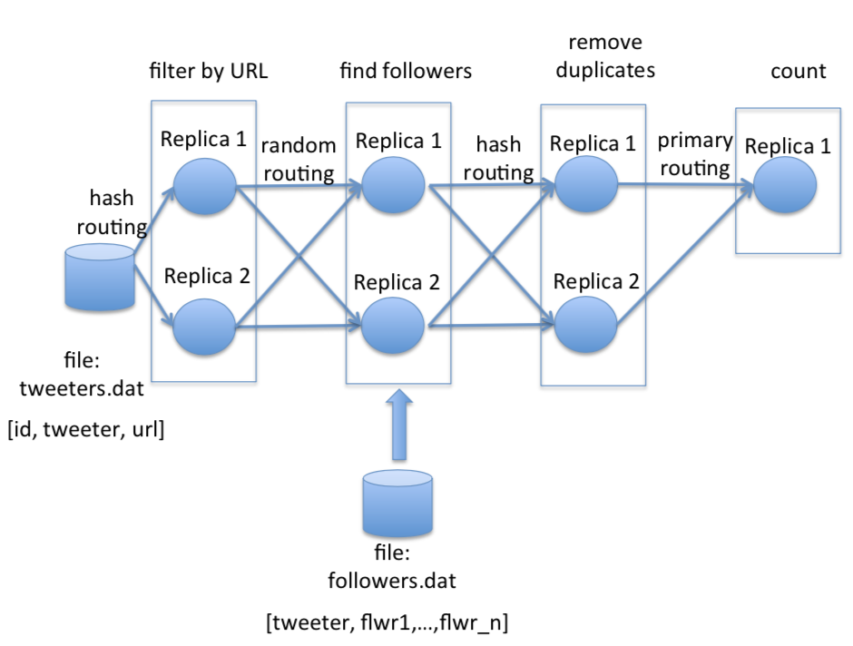

# DADSTORM
  A simplified implementation of a fault-tolerant real-time distributed stream processing system. A stream processing application is composed of a set of operators, each transforming a stream of tuples that is submitted to the operator’s input and that is output by the operator in its processed form.

This project was implemented using C# and .Net Remoting.

## System Architecture
  In DADSTORM, a distributed computation can be expressed as a direct acyclic graph, whose vertexes consist of operators that operate on a stream of input data and may emit, for each input tuple, a set of corresponding output tuples. Operators can consume input data either from files or be fed with the output data produced by other operators, which allows for expressing arbitrary computations, as long as the resulting topology/graph remains acyclic.

The topology of the system can be described in a configuration file, which is composed by line with the following format:

operator_id INPUT_OPS source_op_id_1|filepath_1, ... ,source_op_id_n|filepath_n 
  REP_FACT repl_factor ROUTING primary|hashing|random
  ADDRESS URL1, ... ,URL_REP_FACT
  OPERATOR_SPEC operator_type operator_param_1, ... ,operator_param_n
  
where:
  - The _OPERATOR_ID_ parameter is an integer identifying the operator.
  - The _INPUT_OPS_ parameter specifies a list of operator identifiers that provide input tuples for the current operator or paths to files from which the operator should read its input tuples.
  - The _REP_FACT_ parameter indicates how many replicas of this operator will be activated.
  - The _ROUTING_ policy parameter specifies how the input tuples which are consumed by the operator should be distributed among its replicas. It has three possible values whose semantics are described below.
  - The _ADDRESS_ parameter specifies a list of all the replicas URLs. These URLs are in the format `tcp://<machine-ip>:<port>/op`.
  - The _OPERATOR_SPEC_ parameter indicates the name of the tuple transformation being performed at this operator and it is followed by a list of the input parameters required by the operator.
  
  In the figure below there's a physical representation of a _full_ working system, where are descripted the routing systems used between operators and the functions performed by each one.
  
  
### Tuple Routing
The DADSTORM implements three different policies for tuple routing from one operator to another:
  - **_Primary_**: tuples are output to the primary replica of the operator it is connected to downstream.
  - **_Random_**: tuples are output to a random replica of the downstream operator.
  - **_Hashing(field_id)_**: tuples are forwarded to a replica of the downstream operator according to the value of a hashing function computed on the tuple’s field with identifier _field_id_.

### Operators
The DADSTORM implements the following set of operators:
  - _UNIQ field_number_: emit the tuple again if field number field is unique.
  - _COUNT_: emit the number of seen tuples.
  - _DUP_: emit the tuple as is in input.
  - _FILTER field_number, condition, value_: emit the input tuple if field_number is larger(”>”), smaller(”<”) or equal(”=”) than value.
  - _CUSTOM dll ,class, method_: this command send each tuple it receives, in the form of a list of strings, to a custom _method_ of a _class_ within a specific class library(_dll_) and outputs the tuples returned by the _method_.

## Fault-Tolerant Capabilities
  In a distributed stream processing system, such as the one described so far, it is of paramount importance that the occurrence of failures does not compromise the correctness of the distributed computation. If such system is used for real-time purposes, it is also desirable that performance remains predictable despite the occurrence of failures, e.g., by minimizing the amount of data that has to be reprocessed if a subset of machines in the system fail and by enhancing data availability via replication techniques.
  In case of failures, the system should reconfigure automatically, without disrupting the processing of the stream of tuples. For instance, if a downstream operator crashes, the upstream operator should automatically reconfigure its routing strategy so that he propagates its results only to available replicas of the downstream operator, and no tuples should be lost.
  
 ### Tuple Processing Semantics
  The system should support three different guarantees regarding the semantics of processing of each input tuple in presence of possible failures:
  - **At Most Once**: Tuples may or be not processed, i.e., some tuples may be lost in presence of operator failures. E.g., all the tuples sent towards an operator downstream may be lost if this is unavailable.
  - **At Least Once**: Tuples are guaranteed to be processed at least once, i.e., no tuple in input is missed. Yet, it cannot be excluded that an operator processes twice a tuple, e.g., once before crashing and a second time upon recovering.
  - **Exactly Once**: Tuples are guaranteed to be processed exactly once. This also ensures exactly once semantics not only for the update of the internal state of the operators involved in the processing, but also for the execution of any non-idempotent action (e.g., interaction with external devices like DBMSs or storage systems) issued by the operators during the processing of a tuple.
  
  The tuple processing semantics for the entire computation are specified in the configura- tion file in a line with the following syntax:
  - **Semantics** at-most-once|at-least-once|exactly-once
  
 Depending on the type of operator, and on the requested execution semantics, replicas of an operator may have to agree on/decide:
 - Order of input events.
 - Whether an input event has already been processed. 
 - How long it is necessary to buffer output events.
 
  The goal is to exploit the benefits of replication while avoiding having to reprocess large number of events in case of faults of nodes.

More details of the project implementation and the overall description of the system can be found over the project report that is provided on the repository.
